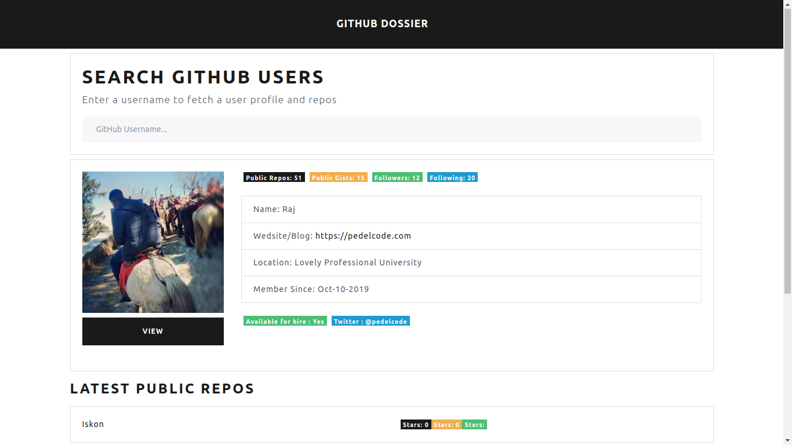

# GitHub Dossier

#### This web application leverages the [GitHub API](https://api.github.com) and shows info of GitHub Users

 

#### [Click Here](https://Radioactive92177.github.io/GitHub-Dossier) to try it now

 

> As mentioned in the **description**, this project was associated to [Brad Traversy](https://github.com/bradtraversy)'s Modern JavaScript course.
> 
>  
> 
> > \*Though in that course, the project was made in pure **Vanilla JavaScript** but I converted the whole project into a **React App\***
> 
>  
> 
> ##### The Course version of the project project can be found [here](https://github.com/Radioactive92177/GitHub-Dossier/tree/TutorialVersion)

 

## What it looks like!

